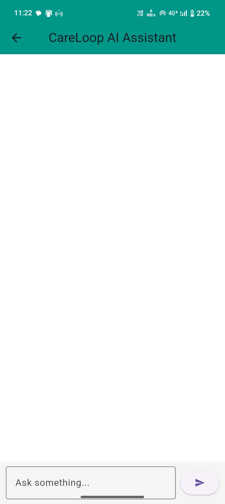
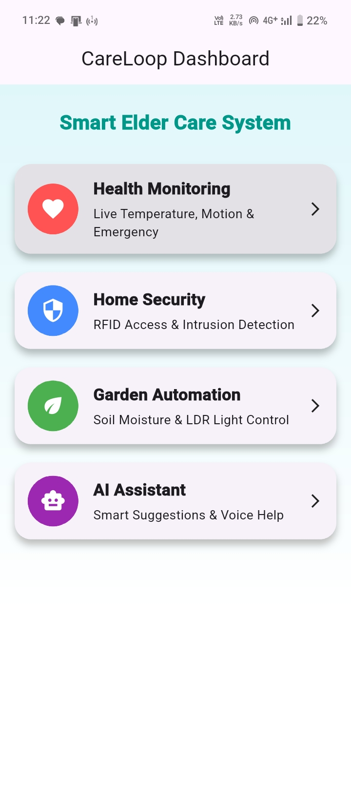
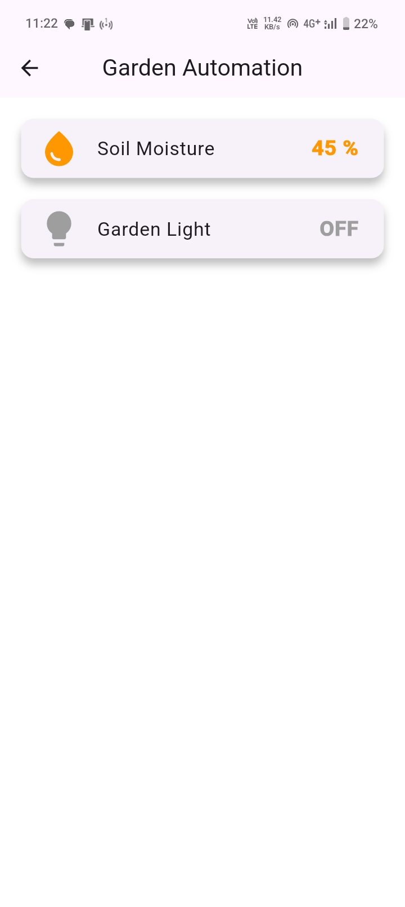
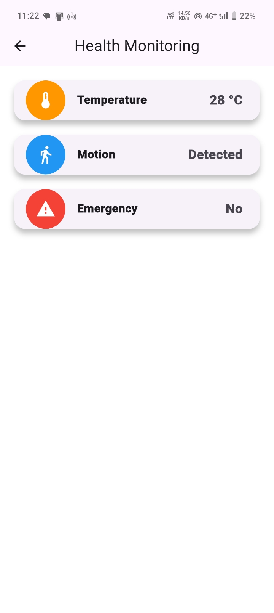
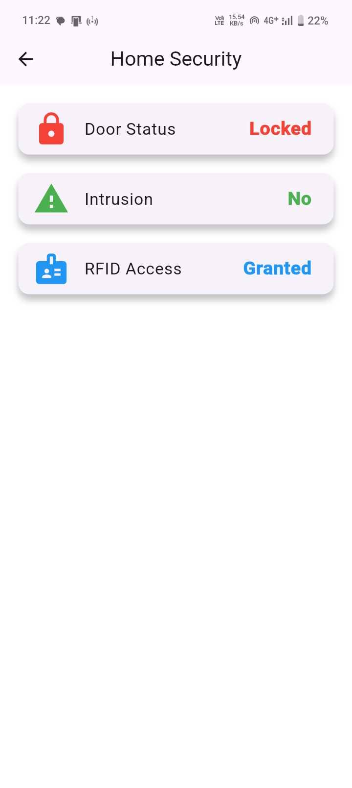

# CareLoop – Smart Elder Care System

## 📌 Overview
CareLoop is an AI-powered system designed to monitor elderly people by integrating health tracking, home security, and automation.

## 🚀 Features
- Health Monitoring
- Door Status Detection
- Intrusion Alert System
- RFID Access Control
- AI Assistant

## 🛠 Tech Stack
- Flutter
- Firebase
- IoT Sensors

## ▶ How to Run
cd elder_care_app
flutter run -d chrome

## 👨‍💻 Developer
Arunagiri S

## 📸 Screenshots

### 🧠 AI Assistant

### 📊 Dashboard

### 🌱 Garden Automation

### ❤️ Health Monitoring

### 🔐 Home Security

## 🎥 Demo Video

[Click here to watch demo](https://drive.google.com/file/d/1AJH5DOth0B6uSJzLIUCLgErsiAD2nkgD/view?usp=drive_link)
